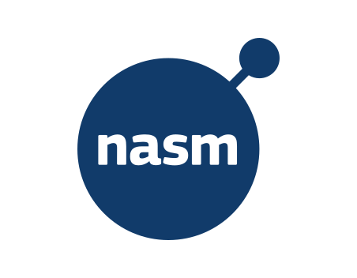

  

<h1 align="center">👨‍💻 Gabriel Derrel 🖖</h1>

  

<h2 align="center">⚡ Tecnologias</h2>

  
  
  
  
  
  
  

<h2 align="center">📊 Estatísticas</h2>

  
  

  

  <a href="https://github.com/gabriel0derrel.gpg" target="_blank">
    
    <strong> Minha Chave GPG Pública</strong>
  </a>

  

